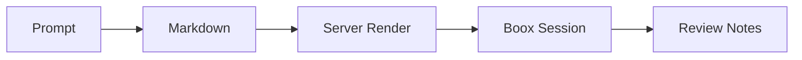

# Diagram Showcase

This document exercises the supported diagram syntaxes end to end.

## Standard Flow



## Coding Task Plan

```mindmap
root: Diagram Support
index: true
nodes:
  - id: docs
    label: Document syntax
    color: blue
    kind: todo
    file: docs/diagram-syntax.md
  - id: render
    label: Render pipeline
    color: green
    kind: module
    file: server/src/render.rs
    children:
      - id: mermaid
        label: Mermaid blocks
        kind: function
        symbol: renderMermaid
      - id: mindmap
        label: Mind maps
        kind: function
        symbol: renderMindmap
      - id: graph
        label: Graph layout
        kind: function
        symbol: renderGraph
  - id: verify
    label: Validation loop
    color: amber
    kind: risk
    notes: Smoke test in Chrome against local server
    collapsed: true
    children:
      - label: tests
        kind: todo
      - label: browser smoke check
        kind: todo
```

## System Graph

```graph
layout:
  algorithm: layered
  direction: RIGHT
nodes:
  - id: cli
    label: CLI
    kind: tool
    file: server/src/cli.rs
  - id: server
    label: Server
    kind: backend
    file: server/src/app.rs
  - id: android
    label: Android
    kind: client
    file: android/app/src/main/java/com/flakm/einkbridge/MainActivity.kt
  - id: skill
    label: Claude Skill
    kind: tool
    file: ../nix_dots/home-manager/modules/claude/skills/eink/SKILL.md
edges:
  - from: skill
    to: cli
    label: invokes
    kind: invokes
  - from: cli
    to: server
    label: create session
    kind: submits
  - from: android
    to: server
    label: poll + submit
    kind: polls
```
