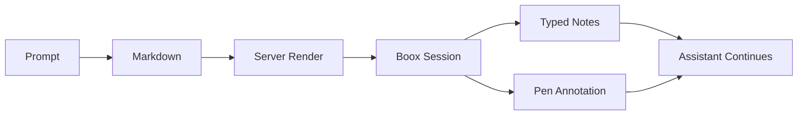
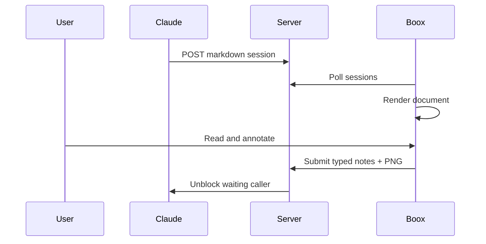

# Render Features Showcase

This single document exercises the full review renderer feature set.

Use it as the canonical smoke-test document for the e-ink review page.

## What This Covers

- normal Markdown prose
- Mermaid rendering from local assets
- mind map rendering
- mind map colors with grayscale-safe border patterns
- mind map index navigation
- mind map collapse and expand
- mind map metadata panel
- graph rendering with ELK layout
- graph badges, arrowheads, edge labels, and edge semantics
- graph metadata panel
- unsupported fenced blocks staying plain Markdown

## Mermaid Overview



## Mermaid Sequence



## Coding Task Mind Map

```mindmap
root: Render Completion
index: true
nodes:
  - id: docs
    label: Document syntax
    color: blue
    kind: todo
    file: docs/diagram-syntax.md
    notes: Public authoring reference for all supported blocks.
  - id: renderer
    label: Render pipeline
    color: green
    kind: module
    file: server/src/render.rs
    children:
      - id: mermaid
        label: Mermaid blocks
        kind: function
        symbol: renderMermaid
      - id: mindmap
        label: Mind maps
        kind: function
        symbol: renderMindmap
      - id: graph
        label: Graph layout
        kind: function
        symbol: renderGraph
  - id: eink
    label: E-ink safety
    color: amber
    kind: decision
    notes: Use light fills, dark borders, badges, and dash patterns so meaning survives grayscale.
  - id: validate
    label: Validation loop
    color: red
    kind: risk
    notes: Validate in Chrome against a locally running server, not only through unit tests.
    collapsed: true
    children:
      - id: tests
        label: Rust test suite
        kind: todo
      - id: browser
        label: Browser smoke check
        kind: todo
      - id: boox
        label: Device read mode
        kind: todo
  - id: graph-jump
    label: Jump to graph section
    color: purple
    kind: todo
    href: "#system-graph"
```

<h2 id="system-graph">System Graph</h2>

```graph
layout:
  algorithm: layered
  direction: RIGHT
  node_spacing: 48
  layer_spacing: 96
nodes:
  - id: skill
    label: Claude Skill
    kind: tool
    file: ../nix_dots/home-manager/modules/claude/skills/eink/SKILL.md
  - id: cli
    label: CLI
    kind: tool
    file: server/src/cli.rs
  - id: server
    label: Server
    kind: backend
    file: server/src/app.rs
  - id: renderer
    label: Renderer
    kind: module
    file: server/src/render.rs
  - id: android
    label: Android
    kind: client
    file: android/app/src/main/java/com/flakm/einkbridge/MainActivity.kt
edges:
  - from: skill
    to: cli
    label: invokes
    kind: invokes
  - from: cli
    to: server
    label: creates session
    kind: submits
  - from: server
    to: renderer
    label: renders html
    kind: depends
  - from: android
    to: server
    label: poll + submit
    kind: polls
```

## Plain Code Block Should Stay Plain

```python
print("This block should remain a normal fenced code block.")
```

## Expected Visual Checks

- Mind map shows a left-side index with top-level items only.
- Selecting a mind-map node updates the details panel.
- Mind-map colored nodes also differ by border pattern.
- Nodes with `kind` show a badge in the node itself.
- The `Validation loop` branch starts collapsed and can be expanded.
- Graph edges show arrowheads.
- Graph edge kinds use different dash patterns.
- Selecting a graph node updates the details panel.
- The Python block remains a code block and is not turned into a diagram.
