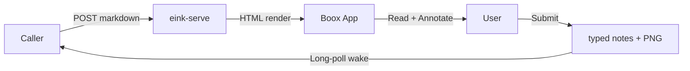
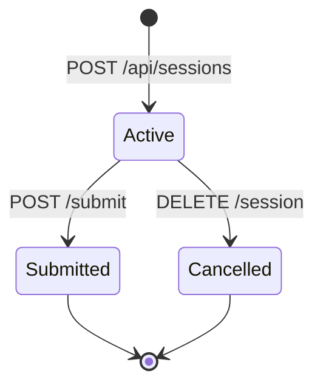
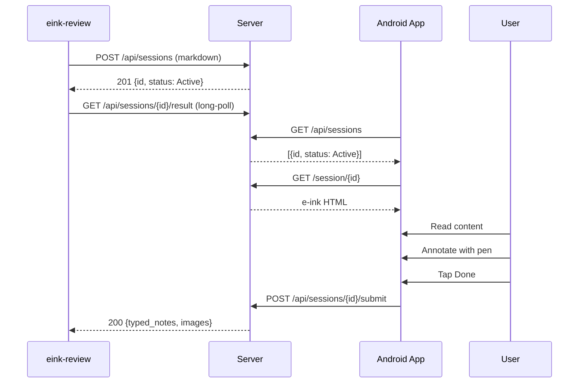
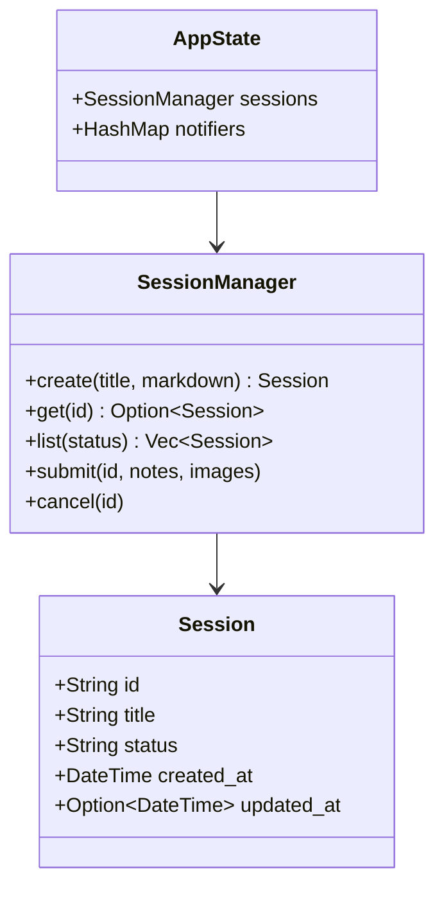
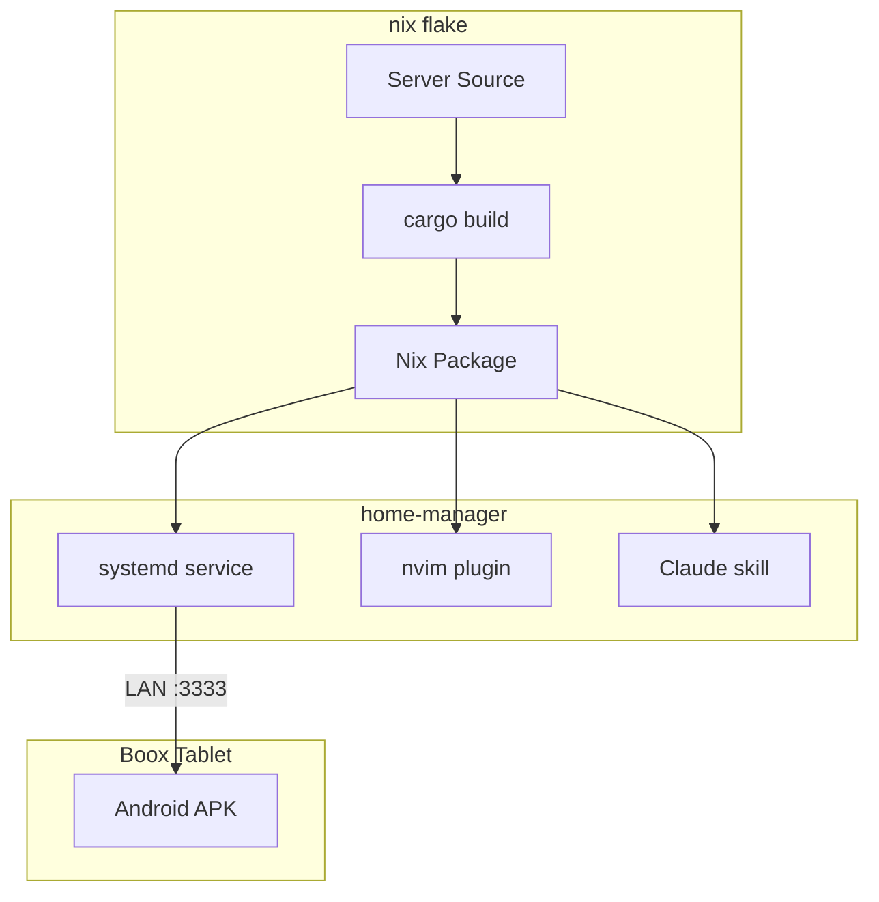

# E-Ink Bridge — Full Feature Showcase

A single document exercising every render capability: prose, code highlighting, Mermaid diagrams, mind maps, and ELK graphs across multiple navigable sections.

---

## 1. Architecture Overview

The system bridges a development machine and a Boox e-ink tablet over LAN. Content flows through five stages: creation, rendering, reading, annotation, and feedback delivery.



Key design choices:

- **Long-poll over WebSocket** — simpler client implementation, works through corporate proxies
- **Server-side rendering** — no JS framework needed on the tablet, just a WebView
- **PNG annotations** — preserves exact pen strokes without vectorization overhead

## 2. Session Lifecycle



### Sequence Detail



## 3. Code Highlighting

Syntax highlighting is powered by syntect with the InspiredGitHub theme, tuned for color e-ink contrast.

### Rust — The Render Pipeline

```rust
use pulldown_cmark::{CodeBlockKind, Event, Options, Parser, Tag, TagEnd, html};
use syntect::highlighting::ThemeSet;
use syntect::html::highlighted_html_for_string;
use syntect::parsing::SyntaxSet;

static SYNTAX_SET: LazyLock<SyntaxSet> = LazyLock::new(SyntaxSet::load_defaults_newlines);
static THEME: LazyLock<Theme> = LazyLock::new(|| {
    ThemeSet::load_defaults().themes["InspiredGitHub"].clone()
});

fn highlight_code(lang: &str, code: &str) -> String {
    let syntax = SYNTAX_SET
        .find_syntax_by_token(lang)
        .unwrap_or_else(|| SYNTAX_SET.find_syntax_plain_text());
    highlighted_html_for_string(code, &SYNTAX_SET, syntax, &THEME)
        .unwrap_or_else(|_| format!("<pre><code>{}</code></pre>", code))
}
```

### Python — Session Polling

```python
import asyncio
import httpx

async def poll_until_submitted(server: str, session_id: str, timeout: float = 300):
    """Block until the e-ink reviewer submits feedback."""
    async with httpx.AsyncClient() as client:
        deadline = asyncio.get_event_loop().time() + timeout
        while asyncio.get_event_loop().time() < deadline:
            resp = await client.get(
                f"{server}/api/sessions/{session_id}/result",
                timeout=35,
            )
            if resp.status_code == 200:
                return resp.json()
            await asyncio.sleep(1)
    raise TimeoutError(f"Session {session_id} not submitted within {timeout}s")
```

### Go — HTTP Handler

```go
package main

import (
	"encoding/json"
	"net/http"
	"sync"
)

type Session struct {
	ID     string `json:"id"`
	Status string `json:"status"`
	Title  string `json:"title"`
}

type Store struct {
	mu       sync.RWMutex
	sessions map[string]*Session
}

func (s *Store) HandleList(w http.ResponseWriter, r *http.Request) {
	s.mu.RLock()
	defer s.mu.RUnlock()

	result := make([]*Session, 0, len(s.sessions))
	for _, sess := range s.sessions {
		result = append(result, sess)
	}

	w.Header().Set("Content-Type", "application/json")
	json.NewEncoder(w).Encode(result)
}
```

### TypeScript — Android WebView Bridge

```typescript
interface ReviewPayload {
  sessionId: string;
  typedNotes: string;
  annotations: Blob[];
}

async function submitReview(server: string, payload: ReviewPayload): Promise<void> {
  const form = new FormData();
  form.append("typed_notes", payload.typedNotes);
  payload.annotations.forEach((blob, i) => {
    form.append("annotation", blob, `stroke_${i}.png`);
  });

  const resp = await fetch(`${server}/api/sessions/${payload.sessionId}/submit`, {
    method: "POST",
    body: form,
  });

  if (!resp.ok) {
    throw new Error(`Submit failed: ${resp.status}`);
  }
}
```

### Shell — Quick Review Script

```bash
#!/usr/bin/env bash
set -euo pipefail

SERVER="${EINK_SERVER:-http://localhost:3333}"
FILE="${1:?Usage: review.sh <file.md>}"

echo "Pushing $FILE for review..."
RESULT=$(eink-review push --timeout 600 "$FILE")

echo "$RESULT"
echo "---"
echo "Review complete."
```

## 4. Implementation Plan

```mindmap
root: E-Ink Bridge v0.2
index: true
nodes:
  - id: render
    label: Render Engine
    color: blue
    kind: module
    file: server/src/render.rs
    notes: Core HTML generation from markdown
    children:
      - id: syntax
        label: Syntax Highlighting
        color: green
        kind: done
        notes: syntect with InspiredGitHub theme
      - id: diagrams
        label: Diagram Blocks
        color: green
        kind: done
        children:
          - id: mermaid
            label: Mermaid
            kind: done
            symbol: renderMermaid
          - id: mindmap
            label: Mind Maps
            kind: done
            symbol: renderMindmap
          - id: elk-graph
            label: ELK Graphs
            kind: done
            symbol: renderGraph
      - id: typography
        label: Typography
        color: green
        kind: done
        notes: Georgia serif, 28px base, 1.7 line-height
  - id: android
    label: Android App
    color: blue
    kind: module
    file: android/app/src/main/java/com/flakm/einkbridge/MainActivity.kt
    children:
      - id: pen
        label: Pen Overlay
        color: green
        kind: done
        file: android/app/src/main/java/com/flakm/einkbridge/PenOverlay.kt
        notes: Onyx SDK, pencil + brush styles
      - id: sessions
        label: Session List
        color: green
        kind: done
        notes: RecyclerView with status icons and relative timestamps
      - id: submit
        label: Submit Flow
        color: green
        kind: done
        notes: Typed notes dialog + PNG export
      - id: health
        label: Health Check
        color: green
        kind: done
        notes: GET /api/health on connect
  - id: cli
    label: CLI Tool
    color: blue
    kind: module
    file: server/src/cli.rs
    children:
      - id: push
        label: push (blocking)
        kind: done
      - id: list
        label: list / result / cancel
        kind: done
  - id: backlog
    label: Backlog
    color: amber
    kind: risk
    collapsed: true
    children:
      - id: line-numbers
        label: Line Numbers in Code
        color: red
        kind: todo
      - id: search
        label: In-document Search
        color: red
        kind: todo
      - id: multi-page
        label: Multi-page Navigation
        color: red
        kind: todo
```

## 5. System Architecture Graph

```graph
layout:
  algorithm: layered
  direction: RIGHT
  node_spacing: 60
  layer_spacing: 180
nodes:
  - id: cli
    label: eink-review
    kind: binary
    file: server/src/cli.rs
  - id: nvim
    label: Neovim Plugin
    kind: integration
    file: eink-bridge.lua
  - id: claude
    label: Claude Code Skill
    kind: integration
    file: SKILL.md
  - id: server
    label: eink-serve
    kind: binary
    file: server/src/main.rs
  - id: sessions
    label: SessionManager
    kind: module
    file: server/src/session.rs
  - id: renderer
    label: Render Engine
    kind: module
    file: server/src/render.rs
  - id: fs
    label: Filesystem
    kind: storage
  - id: app
    label: Android App
    kind: client
    file: android/app
  - id: pen
    label: Pen Overlay
    kind: module
    file: PenOverlay.kt
edges:
  - from: cli
    to: server
    label: HTTP
    kind: invokes
  - from: nvim
    to: cli
    label: shell exec
    kind: invokes
  - from: claude
    to: cli
    label: shell exec
    kind: invokes
  - from: server
    to: sessions
    label: CRUD
    kind: reads
  - from: server
    to: renderer
    label: markdown → HTML
    kind: invokes
  - from: sessions
    to: fs
    label: persist JSON
    kind: writes
  - from: app
    to: server
    label: poll + submit
    kind: polls
  - from: pen
    to: app
    label: strokes → PNG
    kind: submits
```

## 6. Class Diagram



## 7. Deployment



## 8. Review Checklist

Before shipping, verify on the actual Boox device:

| Feature | Expected | Status |
|---------|----------|--------|
| Prose readability | Georgia serif, high contrast | Verify |
| Code highlighting | Distinct colors for keywords, strings, comments | Verify |
| Mermaid diagrams | Renders without JS errors | Verify |
| Mind map navigation | Click nodes, expand/collapse, index sidebar | Verify |
| Graph layout | ELK positions nodes, arrows render | Verify |
| Pen annotation | Pencil + brush, undo, clear | Verify |
| Submit flow | Notes dialog, PNG export | Verify |
| Toolbar usability | Buttons responsive during annotate mode | Verify |

> Use this document as the canonical smoke test for the e-ink review page.
