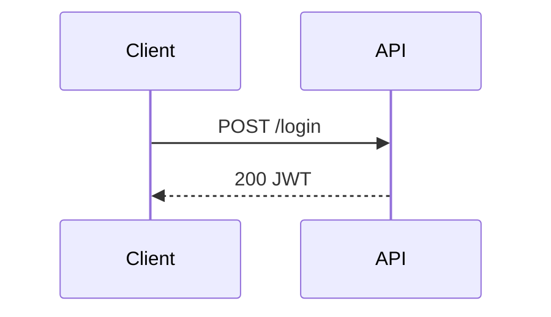

# E-Ink Review

Push content to the Boox for reading and annotation. Supports iterative rounds: the user annotates and taps "Request Update", the agent rewrites the document, and the tablet reloads automatically.

## Usage

```
/eink [file]
```

- If a file path is given, push it directly.
- Otherwise, write a context summary to `/tmp/eink-review-XXXXX.md`.

## Steps

### 1. Determine content

- If the user provided a file path, use it directly.
- Otherwise, write a context summary to `/tmp/eink-review-XXXXX.md`.

### 2. Start the interactive push in the background

Redirect **only stdout** to the logfile (stderr goes to terminal — keeps event log clean):

```bash
LOGFILE=$(mktemp /tmp/eink-events-XXXXX.log)
eink-review push --interactive --timeout 60 <file> >"$LOGFILE" 2>/dev/null &
echo "PID:$! LOG:$LOGFILE"
```

### 3. Get the session ID

The first line of the logfile is always `SESSION_ID:<id>`:

```bash
sleep 2 && grep -m1 "^SESSION_ID:" "$LOGFILE"
```

Parse the session ID: strip the `SESSION_ID:` prefix.

Set `NEXT_LINE=2` (line 1 is the SESSION_ID, already consumed).

### 4. Event loop

Poll in a loop until `EVENT:SUBMITTED` appears. Between polls, sleep 3 seconds.

```bash
tail -n +$NEXT_LINE "$LOGFILE"
```

After reading, advance `NEXT_LINE` by the number of lines returned.

**Logfile line format:**

| Prefix | Meaning |
|--------|---------|
| `SESSION_ID:<id>` | Line 1 only — already consumed |
| `EVENT:ANNOTATION_RESULT <json>` | User tapped "Request Update", OCR complete |
| `EVENT:SUBMITTED <json>` | User submitted — exit the loop |
| anything else | Ignore (trailing print_result output) |

---

**On `EVENT:ANNOTATION_RESULT <json>`:**

Strip the `EVENT:ANNOTATION_RESULT ` prefix to get the JSON. Structure:

```json
{
  "type": "annotation_result",
  "version": 2,
  "annotations": [
    {
      "recognized_text": "expand this section",
      "anchor": {
        "type": "proximity",
        "elements": [
          { "section_id": "section-background", "tag": "h2", "text": "Background" }
        ]
      }
    },
    {
      "recognized_text": "wrong — fix",
      "anchor": null
    }
  ]
}
```

Key fields:
- `version` — which document version the user annotated
- `annotations[].recognized_text` — OCR'd handwriting (may have errors; use judgement)
- `annotations[].anchor.elements[].tag` — `h1`, `h2`, `p`, etc.
- `annotations[].anchor.elements[].text` — nearby element text (use to locate the section)
- `anchor: null` — annotation not near any element; treat as general comment

**Each round is fresh**: annotations contain only the strokes currently on the tablet. The user may clear strokes between rounds. Do not re-apply feedback from previous rounds.

Rewrite the document:
- Apply feedback to the annotated sections (correct, expand, simplify, etc.)
- Leave un-annotated sections unchanged
- **Preserve heading text exactly** — heading IDs are derived from heading text and used for anchoring in subsequent rounds. Changing a heading breaks its anchor.

Write updated content to `/tmp/eink-update-XXXXX.md`.

Push the update (fast HTTP PUT — tablet reloads in ~25ms):

```bash
eink-review update <session-id> /tmp/eink-update-XXXXX.md
```

Sleep 3 seconds, then poll again for the next event.

---

**On `EVENT:SUBMITTED <json>`:**

Parse `result.annotation_images[]` — use the **Read** tool to view each PNG.

Break out of the event loop. Do not process any further lines.

### 5. After all rounds

Summarize all feedback received across rounds and continue the conversation informed by it.

### 6. On failure

- Exit 1 or timeout → report the error.
- Connection refused → `systemctl --user start eink-serve`.

---

## Authoring Rich Review Documents

**Always use colors and diagrams.** The Boox is a color e-ink tablet — take advantage of it. Plain prose is fine for text, but any architecture, plan, status breakdown, or relationship should be a colored graph or mindmap.

The renderer supports normal Markdown plus three diagram types:

- `mermaid` for flowcharts, sequence diagrams, state machines
- `mindmap` for plans, review branches, task decomposition
- `graph` for component relationships, data flows, architecture maps

### Color semantics — use these consistently

| Color | Meaning |
|-------|---------|
| `red` | Problem, blocker, broken, needs attention |
| `green` | Good, done, healthy, approved |
| `amber` | Warning, uncertain, in progress |
| `blue` | Information, reference, external |
| `purple` | Key decision or design point |
| `slate` | Deprioritized, deferred, secondary |

### `graph` — architecture and data flow

```graph
layout:
  algorithm: layered
  direction: RIGHT
nodes:
  - id: user
    label: User
    kind: client
    color: blue
  - id: api
    label: API Server
    kind: backend
    color: green
edges:
  - from: user
    to: api
    label: HTTPS
```

### `mindmap` — plans and code review

```mindmap
root: Fix Auth Bug
index: true
nodes:
  - id: root
    label: Root Cause
    color: amber
    children:
      - label: Token expiry misconfigured
        color: red
```

### `mermaid` — flows and sequences



## Guidance

- Push to the Boox whenever the user needs to review a plan, architecture, or diff.
- Prefer a graph or mindmap over a bullet list whenever structure or status matters.
- Color every node intentionally — `red` for what needs attention, `green` for what's good.
- The `eink-serve` systemd service must be running. Connection refused → `systemctl --user start eink-serve`.
- Do NOT proceed with other work while waiting — the review is the user's input.
- After all rounds complete, summarize all feedback and continue informed by it.
