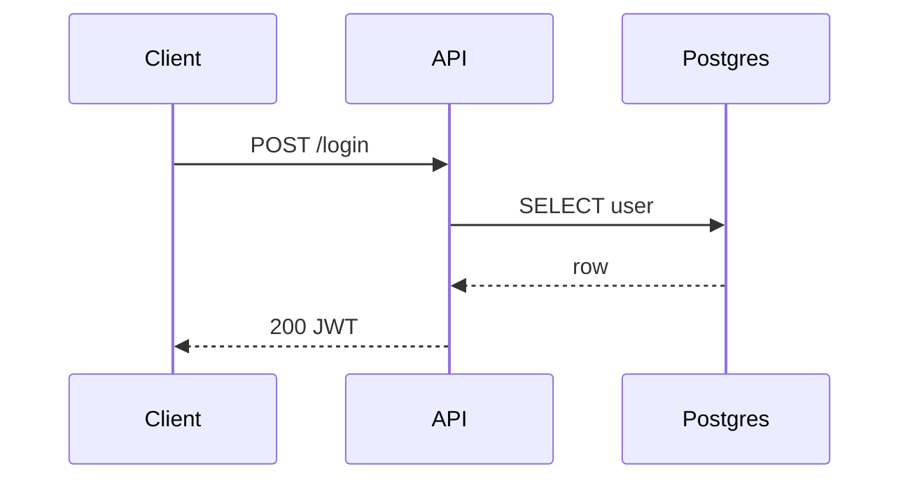

# E-Ink Review

Push content to the Boox for reading and annotation. Blocks until the user submits their review, then returns annotation image paths as context.

## Usage

```
/eink [file]
```

- If a file path is given, push that file.
- If no argument, push the current conversation state (process it into a markdown report)

## Steps

1. Determine content to push:
   - If the user provided a file path argument, use that file directly.
   - Otherwise, write the context summary to temporary markdown file (`/tmp/eink-review-XXXXX.md`).

2. Run the CLI (blocking):
```bash
eink-review push --timeout 30 <file>
```

3. The command blocks until the Boox user submits their review or the timeout expires.

4. Parse the result. The output shape on success:
```
--- review notes (session abc123) ---

## Attached Images
/home/user/.local/state/eink-bridge/sessions/abc123/annotations/img_001.png
```

5. **Import the review:**
   - For each path in the Attached Images section, use the **Read** tool to view the PNG. This lets you see handwritten pen annotations.
   - After reading all images, summarize what the user drew, then continue the conversation informed by their feedback.

6. On failure (exit 1): report the error (timeout, cancelled, server not running).

## Authoring Rich Review Documents

**Always use colors and diagrams.** The Boox is a color e-ink tablet — take advantage of it. Plain prose is fine for text, but any architecture, plan, status breakdown, or relationship should be a colored graph or mindmap. Color is not decoration — it carries meaning at a glance without requiring reading.

The renderer supports normal Markdown plus three diagram types:

- `mermaid` for flowcharts, sequence diagrams, state machines
- `mindmap` for plans, review branches, task decomposition
- `graph` for component relationships, data flows, architecture maps

### Color semantics — use these consistently

| Color | Meaning |
|-------|---------|
| `red` | Problem, blocker, broken, needs attention |
| `green` | Good, done, healthy, approved |
| `amber` | Warning, uncertain, in progress |
| `blue` | Information, reference, external |
| `purple` | Key decision or design point |
| `slate` | Deprioritized, deferred, secondary |

### `graph` — architecture and data flow

Use `graph` for component maps. Assign `kind` to each node for border patterns (tool, backend, client, service). Use edge `label` and `kind` to describe the relationship.

```graph
layout:
  algorithm: layered
  direction: RIGHT
nodes:
  - id: user
    label: User
    kind: client
    color: blue
  - id: api
    label: API Server
    kind: backend
    color: green
  - id: db
    label: Postgres
    kind: service
    color: slate
  - id: cache
    label: Redis
    kind: service
    color: amber
  - id: broken
    label: Auth Service
    kind: backend
    color: red
    notes: "502 errors since deploy"
edges:
  - from: user
    to: api
    label: HTTPS
  - from: api
    to: db
    kind: writes
  - from: api
    to: cache
    kind: reads
  - from: api
    to: broken
    kind: invokes
```

### `mindmap` — plans and code review

Use `mindmap` for implementation plans and review breakdowns. Color nodes by status or risk. Collapse sub-trees that are done to focus attention on what matters.

```mindmap
root: Fix Auth Bug
index: true
nodes:
  - id: repro
    label: Reproduce
    color: green
    children:
      - label: staging repro confirmed
      - label: local repro fails
  - id: root
    label: Root Cause
    color: amber
    children:
      - label: JWT clock skew?
        color: amber
      - label: Token expiry misconfigured
        color: red
        notes: "most likely — check config diff"
  - id: fix
    label: Fix
    color: slate
    collapsed: true
    children:
      - label: Add tests
      - label: Patch config
      - label: Deploy staging
```

### `mermaid` — flows and sequences

Use mermaid for request flows, state machines, or CI pipelines.



## Guidance

- Push to the Boox whenever the user needs to review a plan, architecture, or diff — reading on paper with a stylus surfaces things that reviewing on screen misses.
- Prefer a graph or mindmap over a bullet list whenever structure or status matters.
- Color every node intentionally — `red` for what needs attention, `green` for what's good.
- The `eink-serve` systemd service must be running. If the command fails with a connection error, tell the user to start it: `systemctl --user start eink-serve`
- Do NOT proceed with other work while waiting — the review is the user's input.
- After receiving annotations, summarize what you see and continue informed by the feedback.
