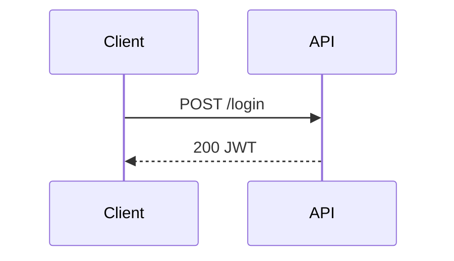

# E-Ink Review

Push content to the Boox for reading and annotation. Supports iterative rounds: the user annotates and taps "Request Update", the agent rewrites the document and calls `update_session`, and the tablet reloads automatically.

Requires the `eink-channel` MCP server to be running (start Claude Code with `--dangerously-load-development-channels server:eink-channel`).

## Usage

```
/eink [file]
/eink continue [session-id]
```

- If a file path is given, push it directly.
- Otherwise, write a context summary to `/tmp/eink-review-XXXXX.md`.
- `continue` resumes watching an already-active session (no new push).

---

## Steps for `/eink continue [session-id]`

1. If no session-id was given, find the most recent active session:
   ```bash
   eink-review list --status active
   ```
   Pick the first ID from the output. If none, tell the user there are no active sessions.

2. For `continue`, the callback_url cannot be added retroactively. Use the watch fallback:
   ```bash
   eink-review watch <SESSION_ID> --timeout 1800 2>/dev/null | while IFS= read -r line; do
     case "$line" in
       EVENT:ANNOTATION_RESULT*|EVENT:SUBMITTED*) echo "$line"; exit 0 ;;
     esac
   done
   echo "EVENT:TIMEOUT"
   ```
   Launch this as a **background Bash command** and proceed as normal.

---

## Steps for a new push

### 1. Determine content

- If the user provided a file path, use it directly.
- Otherwise, **ask the user** before writing anything:
  1. What should the document cover? (topic and scope)
  2. What structure do they want? (prose, bullet list, graph, mindmap, table, or mixed)
  3. Any specific sections, requirements, or constraints?
  4. Depth: overview vs. deep-dive?

  Wait for their answers, then write the document to `/tmp/eink-review-XXXXX.md` based on that input.

### 2. Create session with channel callback URL

```bash
CHANNEL_PORT=${EINK_CHANNEL_PORT:-8789}
SESSION_ID=$(eink-review push --async --callback-url "http://127.0.0.1:$CHANNEL_PORT/" <file>)
echo "SESSION_ID:$SESSION_ID"
```

Immediately after getting the session ID, call the `subscribe_session` tool with it:
```
subscribe_session(session_id="<SESSION_ID>")
```

This claims the session so that webhook events are routed only to this Claude instance and not to other running instances.

Tell the user the session is active. You are free to answer other questions while waiting — events will arrive automatically via the `eink-channel` MCP server.

---

## When a channel event arrives

Channel events arrive as:

```xml
<channel source="eink-channel" event_type="..." session_id="...">
{ ...JSON body... }
</channel>
```

Match `session_id` to the active session. Ignore events for other sessions.

### Case: `event_type="annotation_result"`

JSON body structure:

```json
{
  "type": "annotation_result",
  "version": 2,
  "annotations": [
    {
      "recognized_text": "expand this section",
      "anchor": {
        "type": "proximity",
        "elements": [
          { "section_id": "section-background", "tag": "h2", "text": "Background" }
        ]
      }
    }
  ]
}
```

Key fields:
- `annotations[].recognized_text` — OCR'd handwriting
- `annotations[].anchor.elements[]` — nearby document elements (use to locate sections)
- `anchor: null` — unanchored; treat as general comment

**Each round is fresh** — annotations contain only current strokes. Do not re-apply previous rounds.

Rewrite the document applying the feedback. **Preserve heading text exactly** — IDs are derived from it.

Then call the `update_session` tool:
```
update_session(session_id="<id>", content="<full updated markdown>")
```

The tablet reloads automatically.

### Case: `event_type="submitted"`

JSON is `SessionResultResponse`. Key fields:
- `annotation_images[]` — base64 PNG strings; save each to `/tmp/eink-img-N.png` and use the **Read** tool to view
- `verdict` — `LGTM` or `CHANGES`
- `annotations[]` — final annotation set

Summarize all feedback and continue the conversation.

### Case: `event_type="cancelled"`

Tell the user the session was cancelled.

---

## When the watch fallback returns (continue sessions)

Output starts with `EVENT:ANNOTATION_RESULT` or `EVENT:SUBMITTED` — same JSON structure as above.
Handle identically: rewrite doc → `update_session` for annotation_result, summarize for submitted.

### Case: connection refused

If `eink-review push` fails: `systemctl --user start eink-serve`

---

## Authoring Review Documents

**Be minimalistic.** The reader is on an e-ink tablet — they want to scan, not read essays.

Structure every document like this:
1. **Brief overview** — 1–3 sentences or bullets stating what this is and why it matters.
2. **Body** — short bulleted points, not paragraphs. Break prose into bullets whenever possible.
3. **At most one diagram per document**, and only when structure genuinely cannot be expressed in bullets.

Hard limits:
- Prefer bullets over prose. If a paragraph is more than ~3 lines, split it into bullets.
- **Maximum one diagram per document.** Two only if they show fundamentally different things (e.g. an architecture graph and a state machine). Never use a diagram as decoration.
- Skip the diagram entirely if a bulleted list communicates the same information.
- No "executive summary" + "summary" + "TL;DR" stacking — one overview, then content.

The renderer supports normal Markdown plus the diagram blocks below. Use them sparingly:

- `mermaid` for flowcharts, sequence diagrams, state machines — when ordering or interaction matters
- `mindmap` for plans or decompositions — when a flat bulleted list would obscure hierarchy
- `graph` for architecture maps — when relationships between components are the point

If you find yourself reaching for a second diagram, replace it with bullets.

### Color semantics — use consistently

| Color | Meaning |
|-------|---------|
| `red` | Problem, blocker, broken, needs attention |
| `green` | Good, done, healthy, approved |
| `amber` | Warning, uncertain, in progress |
| `blue` | Information, reference, external |
| `purple` | Key decision or design point |
| `slate` | Deprioritized, deferred, secondary |

### `graph` example

```graph
layout:
  algorithm: layered
  direction: RIGHT
nodes:
  - id: user
    label: User
    kind: client
    color: blue
  - id: api
    label: API Server
    kind: backend
    color: green
edges:
  - from: user
    to: api
    label: HTTPS
```

### `mindmap` example

```mindmap
root: Fix Auth Bug
index: true
nodes:
  - id: root
    label: Root Cause
    color: amber
    children:
      - label: Token expiry misconfigured
        color: red
```

### `mermaid` example



### Mermaid gotchas

**Avoid reserved keywords as participant aliases in `sequenceDiagram`.** Mermaid's
parser is case-insensitive for keywords, so `AND`, `AS`, `END`, `LOOP`, `ALT`,
`OPT`, `PAR`, `NOTE`, `RECT`, `LINK`, `BOX` as short aliases silently break the
parser with an `Expecting 'SPACE', 'NEWLINE', ... got 'and'`-style error. The
diagram then falls back to a parse-error block showing the message and source.

Safe short aliases: `CLI`, `SRV`, `TAB`, `AGT`, `DB`, `API`, `UI`, `WEB`, `SVC`.

If a mermaid block shows a parse error, read the message — it points at the
exact token that clashed. To reproduce locally, open `/eink-webview` and call
`mermaid.render('id', source)` from the Chrome DevTools console.

## Guidance

- Push to the Boox whenever the user needs to review a plan, architecture, or diff.
- Lead with a 1–3 sentence/bullet overview so the reader gets the gist without scrolling.
- Use bullets, not paragraphs. Use at most one diagram per document.
- When you do use a diagram, color every node intentionally — but ask yourself first whether bullets would suffice.
- The `eink-serve` systemd service must be running. Connection refused → `systemctl --user start eink-serve`.
- The `eink-channel` MCP server must be running — start Claude Code with `--dangerously-load-development-channels server:eink-channel`.
- You are NOT blocked while waiting — channel events arrive asynchronously.
- After all rounds complete, summarize all feedback and continue informed by it.
