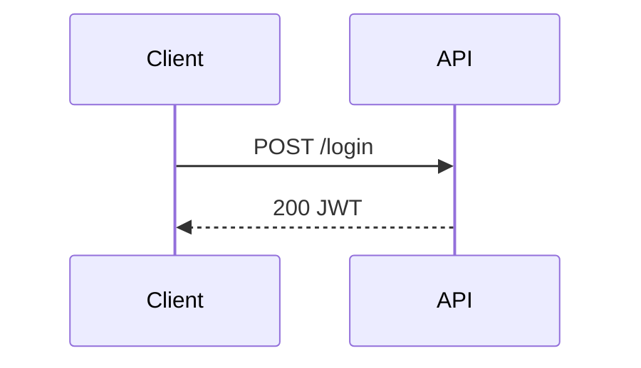

# E-Ink Review

Push content to the Boox for reading and annotation. Supports iterative rounds: the user annotates and taps "Request Update", the agent rewrites the document, and the tablet reloads automatically.

## Usage

```
/eink [file]
```

- If a file path is given, push it directly.
- If no argument, write the current conversation state to a temp markdown file.

## Steps

1. **Determine content:**
   - If the user provided a file path, use it directly.
   - Otherwise, write a context summary to `/tmp/eink-review-XXXXX.md`.

2. **Start the interactive push in the background:**
```bash
LOGFILE=$(mktemp /tmp/eink-events-XXXXX.log)
eink-review push --interactive --timeout 60 <file> >"$LOGFILE" 2>&1 &
echo "PID:$! LOG:$LOGFILE"
```

3. **Get the session ID** (first line emitted to stdout):
```bash
sleep 2 && grep -m1 "^SESSION_ID:" "$LOGFILE"
```
Parse the session ID from `SESSION_ID:<id>`.

4. **Event loop** — poll until `EVENT:SUBMITTED` appears. Track consumed lines with a counter (start at 1):
```bash
tail -n +<NEXT_LINE> "$LOGFILE"
```
After reading, advance `NEXT_LINE` by the number of lines just read.

   **On `EVENT:ANNOTATION_RESULT <json>`:**
   - Parse the embedded JSON: `annotations[]`, `version`
   - For each annotation:
     - `recognized_text` — OCR'd handwriting (may have errors; use judgement)
     - `anchor.elements[]` — `section_id`, `tag`, `text` of nearby document elements
   - Decide what to update. Rewrite the markdown:
     - Keep sections that received no feedback unchanged
     - Apply feedback to anchored sections (correct, expand, simplify, etc.)
     - Preserve heading text and hierarchy — section anchoring depends on stable headings
   - Write updated content to `/tmp/eink-update-XXXXX.md`
   - Push the update (this unblocks the tablet):
   ```bash
   eink-review update <session-id> /tmp/eink-update-XXXXX.md
   ```
   - Poll again for the next event

   **On `EVENT:SUBMITTED <json>`:**
   - Parse `result.annotation_images[]` — use the **Read** tool to view each PNG
   - Break out of the event loop

5. **Summarize all feedback rounds** and continue the conversation.

6. **On failure** (exit 1, timeout, server unreachable):
   - Report the error to the user
   - If connection refused: `systemctl --user start eink-serve`

## Authoring Rich Review Documents

**Always use colors and diagrams.** The Boox is a color e-ink tablet — take advantage of it. Plain prose is fine for text, but any architecture, plan, status breakdown, or relationship should be a colored graph or mindmap.

The renderer supports normal Markdown plus three diagram types:

- `mermaid` for flowcharts, sequence diagrams, state machines
- `mindmap` for plans, review branches, task decomposition
- `graph` for component relationships, data flows, architecture maps

### Color semantics — use these consistently

| Color | Meaning |
|-------|---------|
| `red` | Problem, blocker, broken, needs attention |
| `green` | Good, done, healthy, approved |
| `amber` | Warning, uncertain, in progress |
| `blue` | Information, reference, external |
| `purple` | Key decision or design point |
| `slate` | Deprioritized, deferred, secondary |

### `graph` — architecture and data flow

```graph
layout:
  algorithm: layered
  direction: RIGHT
nodes:
  - id: user
    label: User
    kind: client
    color: blue
  - id: api
    label: API Server
    kind: backend
    color: green
edges:
  - from: user
    to: api
    label: HTTPS
```

### `mindmap` — plans and code review

```mindmap
root: Fix Auth Bug
index: true
nodes:
  - id: root
    label: Root Cause
    color: amber
    children:
      - label: Token expiry misconfigured
        color: red
```

### `mermaid` — flows and sequences



## Guidance

- Push to the Boox whenever the user needs to review a plan, architecture, or diff.
- Prefer a graph or mindmap over a bullet list whenever structure or status matters.
- Color every node intentionally — `red` for what needs attention, `green` for what's good.
- The `eink-serve` systemd service must be running. Connection refused → `systemctl --user start eink-serve`
- Do NOT proceed with other work while waiting — the review is the user's input.
- After all rounds complete, summarize all feedback and continue informed by it.
