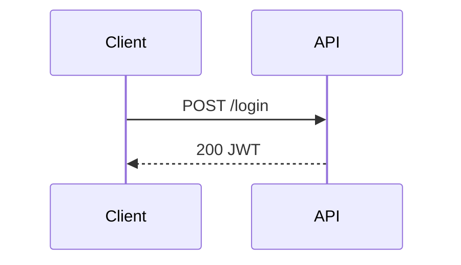

# E-Ink Review

Push content to the Boox for reading and annotation. Supports iterative rounds: the user annotates and taps "Request Update", the agent rewrites the document, and the tablet reloads automatically.

## Usage

```
/eink [file]
/eink continue [session-id]
```

- If a file path is given, push it directly.
- Otherwise, write a context summary to `/tmp/eink-review-XXXXX.md`.
- `continue` resumes watching an already-active session (no new push).

---

## Steps for `/eink continue [session-id]`

1. If no session-id was given, find the most recent active session:
   ```bash
   eink-review list --status active
   ```
   Pick the first ID from the output. If none, tell the user there are no active sessions.

2. For `continue`, the callback_url cannot be added retroactively. Use the watch fallback:
   ```bash
   eink-review watch <SESSION_ID> --timeout 1800 2>/dev/null | while IFS= read -r line; do
     case "$line" in
       EVENT:ANNOTATION_RESULT*|EVENT:SUBMITTED*) echo "$line"; exit 0 ;;
     esac
   done
   echo "EVENT:TIMEOUT"
   ```
   Launch this as a **background Bash command** and proceed as normal.

---

## Steps for a new push

### 1. Determine content

- If the user provided a file path, use it directly.
- Otherwise, write a context summary to `/tmp/eink-review-XXXXX.md`.

### 2. Reserve a webhook port

```bash
PORT=$(python3 -c "import socket; s=socket.socket(); s.bind(('',0)); p=s.getsockname()[1]; s.close(); print(p)")
echo "PORT:$PORT"
```

### 3. Create session with callback URL

```bash
SESSION_ID=$(eink-review push --async --callback-url "http://127.0.0.1:$PORT/" <file>)
echo "SESSION_ID:$SESSION_ID"
```

---

## Launch webhook listener

Run the following as a **background Bash command** (`run_in_background: true`).
Substitute the actual numeric port for `PORT_NUMBER`:

```bash
python3 -c "
import http.server, json

class H(http.server.BaseHTTPRequestHandler):
    def do_POST(self):
        body = self.rfile.read(int(self.headers.get('Content-Length', 0))).decode()
        self.send_response(200)
        self.end_headers()
        data = json.loads(body)
        if data.get('type') == 'annotation_result':
            print('EVENT:ANNOTATION_RESULT ' + body, flush=True)
        elif data.get('status') == 'Submitted':
            print('EVENT:SUBMITTED ' + body, flush=True)
        else:
            print('EVENT:CANCELLED', flush=True)
        raise SystemExit(0)
    def log_message(self, *a): pass

http.server.HTTPServer(('127.0.0.1', PORT_NUMBER), H).handle_request()
"
```

This blocks indefinitely until the server POSTs — no timeout, no reconnect loops.
Tell the user the session is active. You are free to answer other questions while waiting.

---

## When the webhook listener returns

The background Bash command prints one line to stdout. Inspect it:

### Case: annotation result

Output starts with `EVENT:ANNOTATION_RESULT`. JSON follows. Structure:

```json
{
  "type": "annotation_result",
  "version": 2,
  "annotations": [
    {
      "recognized_text": "expand this section",
      "anchor": {
        "type": "proximity",
        "elements": [
          { "section_id": "section-background", "tag": "h2", "text": "Background" }
        ]
      }
    }
  ]
}
```

Key fields:
- `annotations[].recognized_text` — OCR'd handwriting
- `annotations[].anchor.elements[]` — nearby document elements (use to locate sections)
- `anchor: null` — unanchored; treat as general comment

**Each round is fresh** — annotations contain only current strokes. Do not re-apply previous rounds.

Rewrite the document applying the feedback. **Preserve heading text exactly** — IDs are derived from it.

Write updated content to `/tmp/eink-update-XXXXX.md`, then push the update:

```bash
eink-review update <session-id> /tmp/eink-update-XXXXX.md
```

Then **re-launch the webhook listener on the same PORT** (it's free now that the previous listener exited).

### Case: submitted result

Output starts with `EVENT:SUBMITTED`. The JSON is `SessionResultResponse`. Key fields:
- `annotation_images[]` — base64 PNG strings; save each to `/tmp/eink-img-N.png` and use the **Read** tool to view
- `verdict` — `LGTM` or `CHANGES`
- `annotations[]` — final annotation set

Summarize all feedback and continue the conversation.

### Case: cancelled

Output is `EVENT:CANCELLED`. Tell the user the session was cancelled.

### Case: connection refused

If `eink-review push` fails: `systemctl --user start eink-serve`

---

## Authoring Rich Review Documents

**Always use colors and diagrams.** The Boox is a color e-ink tablet — plain prose is fine for
text, but any architecture, plan, status breakdown, or relationship should be a colored graph or mindmap.

The renderer supports normal Markdown plus:

- `mermaid` for flowcharts, sequence diagrams, state machines
- `mindmap` for plans, review branches, task decomposition
- `graph` for component relationships, data flows, architecture maps

### Color semantics — use consistently

| Color | Meaning |
|-------|---------|
| `red` | Problem, blocker, broken, needs attention |
| `green` | Good, done, healthy, approved |
| `amber` | Warning, uncertain, in progress |
| `blue` | Information, reference, external |
| `purple` | Key decision or design point |
| `slate` | Deprioritized, deferred, secondary |

### `graph` example

```graph
layout:
  algorithm: layered
  direction: RIGHT
nodes:
  - id: user
    label: User
    kind: client
    color: blue
  - id: api
    label: API Server
    kind: backend
    color: green
edges:
  - from: user
    to: api
    label: HTTPS
```

### `mindmap` example

```mindmap
root: Fix Auth Bug
index: true
nodes:
  - id: root
    label: Root Cause
    color: amber
    children:
      - label: Token expiry misconfigured
        color: red
```

### `mermaid` example



## Guidance

- Push to the Boox whenever the user needs to review a plan, architecture, or diff.
- Prefer a graph or mindmap over a bullet list whenever structure or status matters.
- Color every node intentionally.
- The `eink-serve` systemd service must be running. Connection refused → `systemctl --user start eink-serve`.
- You are NOT blocked while waiting — the webhook listener runs in the background.
- After all rounds complete, summarize all feedback and continue informed by it.
