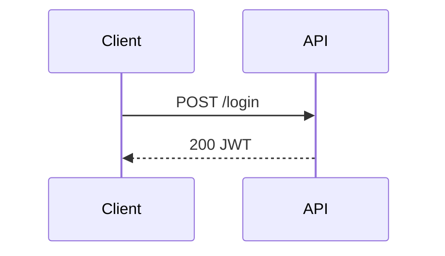

# E-Ink Review

Push content to the Boox for reading and annotation. Supports iterative rounds: the user annotates and taps "Request Update", the agent rewrites the document, and the tablet reloads automatically.

## Usage

```
/eink [file]
/eink continue [session-id]
```

- If a file path is given, push it directly.
- Otherwise, write a context summary to `/tmp/eink-review-XXXXX.md`.
- `continue` resumes watching an already-active session (no new push).

---

## Steps for `/eink continue [session-id]`

1. If no session-id was given, find the most recent active session:
   ```bash
   eink-review list --status active
   ```
   Pick the first ID from the output. If none, tell the user there are no active sessions.

2. Skip to **"Launch background watcher"** below with that session ID.

---

## Steps for a new push

### 1. Determine content

- If the user provided a file path, use it directly.
- Otherwise, write a context summary to `/tmp/eink-review-XXXXX.md`.

### 2. Create session (non-blocking)

```bash
SESSION_ID=$(eink-review push --async <file>)
echo "SESSION_ID:$SESSION_ID"
```

---

## Launch background watcher

Spawn a **background Haiku agent** (`model: haiku`, `run_in_background: true`) with this task:

> You are watching eink session `<SESSION_ID>`.
>
> Run:
> ```bash
> LOGFILE=$(mktemp /tmp/eink-events-XXXXX.log)
> eink-review watch <SESSION_ID> --timeout 60 >"$LOGFILE" 2>/dev/null &
> sleep 2
> ```
>
> Then monitor `$LOGFILE` in a loop (poll every 3 seconds with `tail -n +$NEXT_LINE "$LOGFILE"`),
> advancing `NEXT_LINE` after each read.
>
> **On `EVENT:ANNOTATION_RESULT <json>`:** Return immediately with the annotation JSON so the
> main agent can rewrite the document. Your task is complete for this round — the main agent
> will re-launch you for the next event.
>
> **On `EVENT:SUBMITTED <json>`:** Return immediately with the full submitted JSON result.
>
> **On timeout or error:** Return an error message.

After launching the background watcher, tell the user the session is active and you are watching
in the background. You are free to answer other questions while waiting.

---

## When the background watcher returns

Inspect what it returned:

### Case: annotation result

The Haiku agent returned an `EVENT:ANNOTATION_RESULT` payload. Structure:

```json
{
  "type": "annotation_result",
  "version": 2,
  "annotations": [
    {
      "recognized_text": "expand this section",
      "anchor": {
        "type": "proximity",
        "elements": [
          { "section_id": "section-background", "tag": "h2", "text": "Background" }
        ]
      }
    }
  ]
}
```

Key fields:
- `annotations[].recognized_text` — OCR'd handwriting
- `annotations[].anchor.elements[]` — nearby document elements (use to locate sections)
- `anchor: null` — unanchored; treat as general comment

**Each round is fresh** — annotations contain only current strokes. Do not re-apply previous round's feedback.

Rewrite the document, applying feedback to annotated sections. Leave un-annotated sections unchanged.
**Preserve heading text exactly** — IDs are derived from heading text and used for anchoring.

Write updated content to `/tmp/eink-update-XXXXX.md`, then push the update:

```bash
eink-review update <session-id> /tmp/eink-update-XXXXX.md
```

Then **re-launch the background Haiku watcher** for the next event (same instructions as above).

### Case: submitted result

The Haiku agent returned an `EVENT:SUBMITTED` payload. Parse `result.annotation_images[]` — use
the **Read** tool to view each PNG. Summarize all feedback received and continue the conversation.

### Case: error / timeout

Report the error. If connection refused: `systemctl --user start eink-serve`.

---

## Authoring Rich Review Documents

**Always use colors and diagrams.** The Boox is a color e-ink tablet — plain prose is fine for
text, but any architecture, plan, status breakdown, or relationship should be a colored graph or mindmap.

The renderer supports normal Markdown plus:

- `mermaid` for flowcharts, sequence diagrams, state machines
- `mindmap` for plans, review branches, task decomposition
- `graph` for component relationships, data flows, architecture maps

### Color semantics — use consistently

| Color | Meaning |
|-------|---------|
| `red` | Problem, blocker, broken, needs attention |
| `green` | Good, done, healthy, approved |
| `amber` | Warning, uncertain, in progress |
| `blue` | Information, reference, external |
| `purple` | Key decision or design point |
| `slate` | Deprioritized, deferred, secondary |

### `graph` example

```graph
layout:
  algorithm: layered
  direction: RIGHT
nodes:
  - id: user
    label: User
    kind: client
    color: blue
  - id: api
    label: API Server
    kind: backend
    color: green
edges:
  - from: user
    to: api
    label: HTTPS
```

### `mindmap` example

```mindmap
root: Fix Auth Bug
index: true
nodes:
  - id: root
    label: Root Cause
    color: amber
    children:
      - label: Token expiry misconfigured
        color: red
```

### `mermaid` example



## Guidance

- Push to the Boox whenever the user needs to review a plan, architecture, or diff.
- Prefer a graph or mindmap over a bullet list whenever structure or status matters.
- Color every node intentionally.
- The `eink-serve` systemd service must be running. Connection refused → `systemctl --user start eink-serve`.
- You are NOT blocked while waiting — the Haiku watcher runs in the background.
- After all rounds complete, summarize all feedback and continue informed by it.
