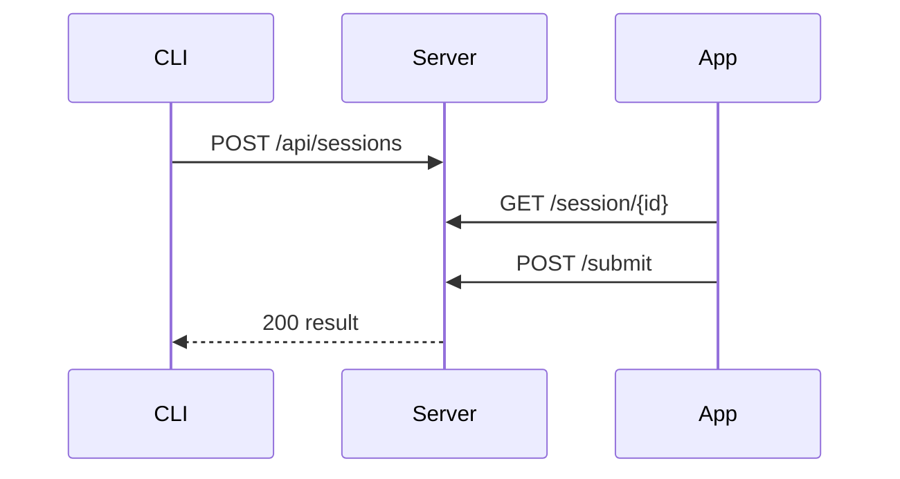

# Architecture Review

The system uses a layered approach with three main components.

## Components

| Component | Language | Role |
|-----------|----------|------|
| Server    | Rust     | HTTP API and rendering |
| CLI       | Rust     | Push/pull interface |
| App       | Kotlin   | Tablet UI |

## Data Flow



## Key Code

```rust
pub fn render(markdown: &str) -> String {
    to_eink_html(markdown, "preview")
}
```

> Note: The renderer handles mermaid, mindmap, and graph blocks natively.
